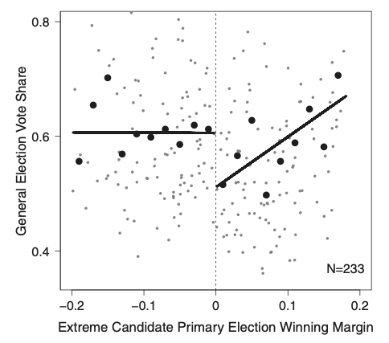

class: middle, center


```{r setup-rmd, include = FALSE, cache = FALSE}
source(here::here("code", "assets", "slide-helpers.R"))
```

```{r inf, include = FALSE, cache = FALSE, eval = FALSE}
xaringan::inf_mr(here::here("slides", "10_causal-modeling", "10_causal-modeling.Rmd"))
# servr::daemon_stop(1)
```


.pull-left[
# **PS 811: Statistical Computing**

<br>
Michael DeCrescenzo
<br>
University of Wisconsin–Madison

]

.pull-right[
```{r title-graphic, include = TRUE, fig.width = 4, fig.height = 3, out.width = "100%"}
tibble(
  x = seq(0, 1, .01)
) %>%
  crossing(b = seq(1, 10, length.out = 5)) %>%
  mutate(dbeta = dbeta(x, 3, b)) %>%
  ggplot() +
  aes(
    x = x, 
    y = dbeta, 
    color = as.factor(b), 
    fill = as.factor(b)
  ) +
  geom_line() +
  geom_ribbon(
    aes(ymin = 0, ymax = dbeta),
    color = NA,
    alpha = 0.2
  ) +
  viridis::scale_fill_viridis(discrete = TRUE, end = 0.9) +
  viridis::scale_color_viridis(discrete = TRUE, end = 0.9) +
  theme(
    axis.text = element_blank(),
    axis.ticks = element_blank(),
    axis.title = element_blank(),
    legend.position = "none",
    panel.border = element_blank(),
    panel.background = element_blank()
  ) 
```

]

## Causal and Predictive Modeling 1/2: <br> Causal Inference

April 24, 2020

---

class: middle

.pull-left[

## Objectives

1. Mathematical models of causal inference

2. Pre-treatment and post-treatment confounding

3. Example: Regression Discontinuity and Bootstrapping
]


.pull-right[

## Code demo

1. `08_rdd-bootstrap.R` from Canvas

2. `hall_house-primaries.dta` from Canvas (save in `data` folder)

]


---

# Causal Inference

"Correlation is not causaion"

Attempts at understanding _how to achieve "causality"_ have been informal or semi-formal


--

### Objectives

1. What is the **causal quantity** that we want to know?

2. What are the **assumptions required** to learn about it?

3. What **research designs/estimation methods** satisfy those assumptions?

---

.pull-left[
## "Potential Outcomes"

a.k.a. the "Rubin" causal model

$Y_{i}$ is a function of treatment $Z_{i}$

$Y_{i}(z)$ is "potential outcome" under treatment $Z = z$

Binary case, $Y_{i}(1)$ and $Y_{i}(0)$.

Causal effect: $Y_{i}(1) - Y_{i}(0)$

**Fundamental problem of causal inference:** never observe both POs for $i$

Causal identification if $Y_{i}(z) \perp \!\!\! \perp Z_{i}$

]

--

.pull-right[

## "DAGs/Do-Calculus"

Judea Pearl (also Robins, Hernán...)

Observing: $p(Y \mid Z = z)$

Intervening: $p(Y \mid \mathit{do}(Z = z))$

Causal effect: $p(Y \mid \mathit{do}(1)) \neq p(Y \mid \mathit{do}(0))$

Causal identification if $p(Y \mid Z) = p(Y \mid \mathit{do}(Z))$

Problem: conditioning on the right stuff. (Directed Acyclic Graphs & _do_-calculus)

]


---

## Causal Models

Two ways of writing the same basic ideas: $Z$ has a causal effect if at least one unit's outcome would be different by changing $Z$

**Fundamental problem of causal inference**: We can't observe whether one unit changes.

Can compare **average outcomes**, but can't make a causal claim **without assumptions**

- Potential outcomes: Treatment assignment is _independent of potential outcomes_ (optional: after conditioning on confounders)

- Do-calculus: The "observed distribution" is equal to the "interventional distribution" (optional: after conditioning on confounders)


---

## What is Confounding

```{r dagages}
library("dagitty")
library("ggdag")
```

```{r confounder-dag}
simple_dag <- 
  dagify(
    Y ~ Z + X,
    Z ~ X,
    coords = tribble(
      ~ name,      ~ x,    ~ y,
      "Y",           1,      0,
      "Z",      0,      0,
      "X",     0.5,      1
    ),
    labels = c(
      "X" = "Confounder",
      "Z" = "Treatment/\nExposure",
      "Y" = "Outcome"
    )
  ) %>%
  tidy_dagitty() %>%
  print()
```

.pull-left[

```{r plot-confound, include = TRUE, out.width = "100%", fig.height = 3.5, fig.width = 5}
ggplot(simple_dag) +
  aes(x = x, y = y, xend = xend, yend = yend) +
  geom_dag_edges() +
  geom_dag_point(shape = 1, color = "black") +
  geom_dag_text(aes(label = name), color = "black") +
  theme_dag() +
  theme(
    panel.background = element_rect(fill = white, color = NA), 
    plot.background = element_rect(fill = white, color = NA)
  ) +
  # theme_dag()
  NULL
```
]


.pull-right[
$X$ confounds the effect of $Z$ on $Y$ (creates a "back door path" from $Z$ to $Y$)

To identify $Z$'s effect, must adjust for $X$ ("block" the back-door path)

Potential outcomes $Y(z) \perp \!\!\! \perp Z \mid X$

or $p(Y \mid do(Z)) = p(Y \mid Z, X)p(X)$

DAG for **nonparametric identification**; does not tell us that linear regression works

]


---

### Collider (a.k.a. "Post-Treatment") Bias


```{r collider-dag}
collider_dag <- 
  dagify(
    Y ~ Z + C + X,
    C ~ Z + X,
    coords = tribble(
      ~ name,      ~ x,    ~ y,
      "Y",           1,      1,
      "Z",      0,      0,
      "C",     0.5,      1,
      "X",     0,      2
    ),
    labels = c(
      "X" = "Confounder",
      "C" = "Collider",
      "Z" = "Treatment/\nExposure",
      "Y" = "Outcome"
    )
  ) %>%
  tidy_dagitty() %>%
  print()
```

.pull-left[

```{r plot-collider, include = TRUE, out.width = "90%", fig.height = 3.5, fig.width = 5}
ggplot(collider_dag) +
  aes(x = x, y = y, xend = xend, yend = yend) +
  geom_dag_edges() +
  geom_dag_point(shape = 1, color = "black") +
  geom_dag_text(aes(label = name), color = "black") +
  theme_dag() +
  theme(
    panel.background = element_rect(fill = white, color = NA), 
    plot.background = element_rect(fill = white, color = NA)
  ) +
  NULL
```

"Bad control" **creates new paths**

- Conditioning on $C$ creates path $Z \rightarrow X \rightarrow Y$

]

--
.pull-right[

Creates relationships that **aren't there**

- Assume attractiveness ( $Z$ ) and personality ( $X$ ) are unrelated
- Both positively affect being in a relationship ( $C$ )
- Among singles ( controlling for $C$ ), attractiveness and personality negatively related

Lots of things affect $Y$. **Doesn't mean you should control for them.**

]


---

## Why experiments work


```{r exp-dag}
exp_dag <- 
  dagify(
    Y ~ Z + X,
    coords = tribble(
      ~ name,      ~ x,    ~ y,
      "Y",           1,      0,
      "Z",      0,      0,
      "X",     1,      1
    )
  ) %>%
  tidy_dagitty() %>%
  print()
```

.pull-left[

```{r plot-exp, include = TRUE, out.width = "100%", fig.height = 4, fig.width = 4.5}
ggplot(exp_dag) +
  aes(x = x, y = y, xend = xend, yend = yend) +
  geom_dag_edges() +
  geom_dag_point(shape = 1, color = "black") +
  geom_dag_text(aes(label = name), color = "black") +
  theme_dag() +
  theme(
    panel.background = element_rect(fill = white, color = NA), 
    plot.background = element_rect(fill = white, color = NA)
  ) +
  NULL
```

]


.pull-right[

Assignment to treatment $Z$ is random.

Even if other factors $X$ affect $Y$, they do not confound the treatment effect

**No back door path** from $Z$ to $Y$ that goes through $X$

]


---

class: middle

.pull-left[
### Causal Assumptions

- Begin with a model of potential outcomes

- What assumptions enable us to identify _causal variation_ in treatment?

- Assumptions usually relate to conditional independences among variables

]


.pull-right[
### Statistical Assumptions

- What **statistical** assumptions are we layering on top of the **causal** assumptions?

- What research designs let us make **fewer assumptions** about functional forms, relevant covariates, etc.?

- Can we **design away** some of these more difficult assumptions?

]


---


### Regression Discontinuity

.pull-left[
Units are treated if value of a "running variable" $X$ falls on one side of a **threshold** (cutoff)

- I win an election if vote margin > 0
- I'm accepted into program if test score high enough

RD design estimates the LOCAL AVERAGE TREATMENT EFFECT **at the cutoff**

- Key assumption: regression function $E[Y \mid X]$ is **continuous at the cutoff**

]


.pull-right[

```{r rdd-plot, include = TRUE, out.width = "100%", fig.width = 4.5, fig.height = 3.25}
filter <- dplyr::filter

fake_data <- 
  tibble(x = seq(-1, 1, .01)) %>%
  mutate(
    y1 = plogis(rnorm(n(), mean = -1)), 
    y2 = plogis(rnorm(n(), mean = 1)),
    control = x < 0,
    observed = (control & x < 0) | (!control & x > 0)
  ) %>%
  dplyr::filter(x != 0)

ggplot(fake_data) +
  aes(x = x) +
  geom_vline(xintercept = 0, color = black) +
  geom_point(
    data = filter(fake_data, x > 0),
    shape = 0, alpha = 0.5,
    aes(y = (y1)), color = primary
  ) +
  geom_point(
    data = filter(fake_data, x < 0),
    shape = 1, alpha = 0.5,
    aes(y = (y2)), color = secondary
  ) +
  geom_line(
    aes(y = (lowess(y1 ~ x)$y), 
        linetype = control & x < 0), 
    color = primary,
    size = 1.5
  ) +
  geom_line(
    aes(y = (lowess(y2 ~ x)$y), linetype = !control & x > 0), 
    color = secondary,
    size = 1.5
  ) +
  coord_cartesian(ylim = c(0, 1)) +
  labs(
    x = "Running Variable",
    y = "Dependent Variable"
  ) +
  annotate(
    geom = "label",
    x = 0.5, y = 0.15,
    size = 4,
    label = "Treatment\n(Observed)",
    fill = white
  ) +
  annotate(
    geom = "label",
    x = -0.5, y = 0.85,
    size = 4,
    label = "Control\n(Observed)",
    fill = white
  ) +
  theme(legend.position = "none")
```

Linear RDD:
\begin{align}
  y_i &= \alpha + \delta \text{Treat}_i + \beta_1 X_{i} + \beta_2 (X_{i} \times \text{Treat}_{i})
\end{align}

]


---

### What Happens When Extremists Win Primaries?

.pull-left[

Hall (2015) RDD study of House candidate ideology and vote share

- Study "close primary elections"
- Extremist candidate narrowly wins or narrowly loses their party's nomination
- When the extremist wins, does their party do worse in the general election?

]

--

.pull-right[

```{r hall, include = TRUE, out.width = "100%"}

```
]


---

## Bootstrapping


.pull-left[

The main idea:

- We want to show "sampling uncertainty" in estimates

- But we are afraid of modeling assumptions about the estimate

- or there is no obvious formula for the standard error

]

--

.pull-right[
Algorithm:

- Original data contains $n$ observations 

- Sample $n$ observations **with replacement** (some observations sampled more than once or not at all)

- Estimate model in the resample

- Repeat many times

]


---

class: center, middle

# Conclusion

Causal inference is possible, if we do the right things

Many common econometric models **do not** give us causal estimates

Many of the variables we control for **make our models worse**

Must know which **assumptions** enable causal inference from non-experimental data

Causal inference can be improved with **computational tools** (special models, bootstrapping, matching, synthetic control, machine learning)

