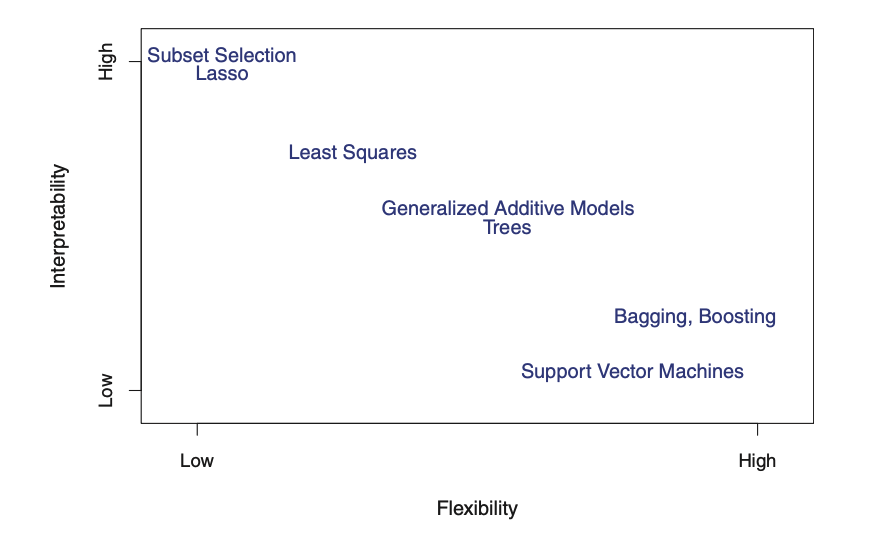
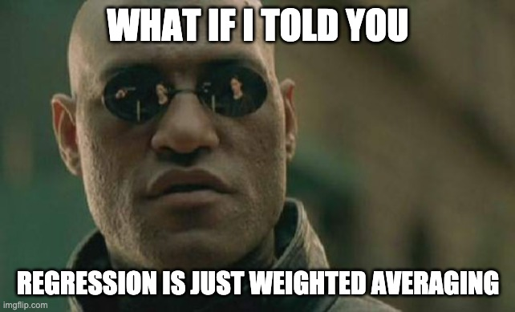
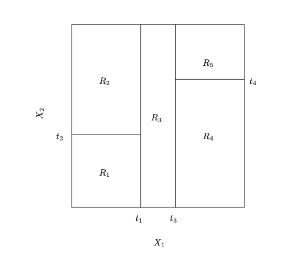
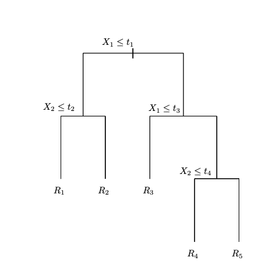
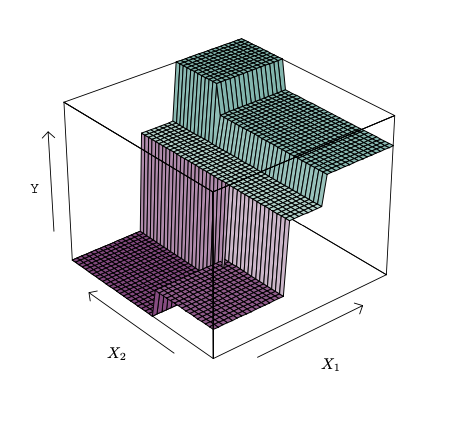
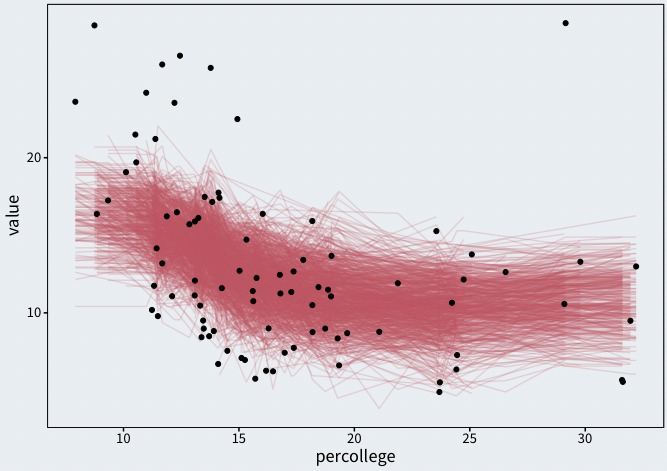

class: middle, center

```{r setup-rmd, include = FALSE, cache = FALSE}
source(here::here("code", "assets", "slide-helpers.R"))
```

```{r inf, include = FALSE, cache = FALSE, eval = FALSE}
xaringan::inf_mr(here::here("slides", "11_predictive-modeling", "11_predictive-modeling.Rmd"))
# servr::daemon_stop(1)
```


.pull-left[
# **PS 811: Statistical Computing**

<br>
Michael DeCrescenzo
<br>
University of Wisconsin–Madison

]

.pull-right[
```{r title-graphic, include = TRUE, fig.width = 4, fig.height = 3, out.width = "100%"}
tibble(
  x = seq(0, 1, .01)
) %>%
  crossing(b = seq(1, 10, length.out = 5)) %>%
  mutate(dbeta = dbeta(x, 3, b)) %>%
  ggplot() +
  aes(
    x = x, 
    y = dbeta, 
    color = as.factor(b), 
    fill = as.factor(b)
  ) +
  geom_line() +
  geom_ribbon(
    aes(ymin = 0, ymax = dbeta),
    color = NA,
    fill = "#DF536B",
    alpha = 0.2
  ) +
  viridis::scale_fill_viridis(discrete = TRUE, end = 0.9) +
  viridis::scale_color_viridis(discrete = TRUE, end = 0.9) +
  theme(
    axis.text = element_blank(),
    axis.ticks = element_blank(),
    axis.title = element_blank(),
    legend.position = "none",
    panel.border = element_blank(),
    panel.background = element_blank()
  ) 
```

]

## Causal and Predictive Modeling 2/2: <br> Predictive Modeling

May 1, 2020

---

class: middle


.pull-left[

### The Interpretability–Flexibility Trade-Off

When is it important for a method to be "interpretable?"

When is it important for a method to be "flexible?"

]

.pull-right[

```{r include = TRUE, out.width = "100%"}

```

James, Witten, Hastie, Tibshirani (2015) <br> "An Introduction to Statistical Learning"

]


---


# Today's Plan

--

.pull-left[
### Limits of Regression

- Prediction: functional form
- Causal inference: identification assumptions
- What **are** regression coefficients anyway? ("Aronow-Samii critique")

]

--

.pull-right[

### "Machine Learning"

- Similar tools, different philosophy
- Objectives of "predictive modeling"
- What makes a good model
- R code coming soon

]


---

class: middle, center, inverse

# Regression Woes


---

## Regression for Prediction

.left-code[

Weighted avg:
\begin{align}
  \bar{x}^{*} = \frac{1}{n} \sum\limits_{i = 1}^{n} w_{i} x_{i}
\end{align}

Linear regression on $K$ variables:
\begin{align}
  \hat{y}_{i} = \sum\limits_{k = 1}^{K} \beta_{k} x_{k[i]}
\end{align}

My responsibility to specify $X$

What even is a "true" model?

]


.right-plot[

```{r what-if, include = TRUE}

```
]


???

It works pretty well in many circumstances, but some fragile assumptions

Where are the "lines?"

Do "lines" best represent what I need to get a good prediction?

Later: are the lines themselves all that important to understand?


---

class: middle

```{r}
# install.packages("gapminder")
library("gapminder")
library("ggforce")
library("mgcv")
library("broom")
library("prediction")
```

```{r, include = TRUE, fig.width = 6, fig.height = 4, out.width = "60%"}
midwest %>%
  filter(state == "OH") %>%
  ggplot() +
  aes(x = percollege, y = percbelowpoverty) +
  # facet_wrap(~ state) +
  geom_point() +
  labs(
    title = "Education and Poverty in Ohio",
    y = "Percent Below Poverty",
    x = "Percent with College Degree"
  )
```

---

class: middle

```{r}
regressions <- midwest %>%
  crossing(model = c("Logarithmic", "Quadratic", "Spline")) %>%
  group_by(state, model) %>%
  nest() %>%
  mutate(
    fit = case_when(
      model == "Logarithmic" ~ map(
        .x = data, .f = ~ lm(percbelowpoverty ~ log(percollege), data = .x)
      ),
      model == "Quadratic" ~ map(
        .x = data, .f = ~ lm(percbelowpoverty ~ percollege + I(percollege^2), data = .x)
      ),
      model == "Spline" ~ map(
        .x = data, .f = ~ gam(percbelowpoverty ~ s(percollege, bs = "gp"), data = .x)
      )
    ),
    predictions = map(
      .x = fit, .f = ~ .x %>%
        augment() %>%
        mutate(
          conf.low = .fitted - .se.fit * qnorm(.975),
          conf.high = .fitted + .se.fit * qnorm(.975)
        ) %>%
        select(.fitted, starts_with("conf"), .resid)
    )
  ) %>%
  print()


```


```{r, include = TRUE, fig.height = 4, fig.width = 9, out.width = "90%"}
regressions %>%
  filter(state == "OH") %>%
  unnest(cols = c(data, predictions)) %>%
  ggplot() +
  aes(x = percollege, y = percbelowpoverty) +
  geom_point() +
  geom_ribbon(
    aes(ymin = conf.low, ymax = conf.high), 
    color = NA,
    fill = "tomato",
    alpha = 0.5
  ) +
  geom_line(aes(y = .fitted)) +
  facet_grid(~ model) +
  labs(
    title = "Predictions from Different Models",
    subtitle = "Some models let the data speak for itself",
    y = "Percent Below Poverty",
    x = "Percent with College Degree"
  )
```


---

## Regression for Causal Inference

```{r}
library("dagitty")
library("ggdag")
```


```{r confounder-dag}
simple_dag <- 
  dagify(
    Y ~ Z + X,
    Z ~ X,
    coords = tribble(
      ~ name,      ~ x,    ~ y,
      "Y",           1,      0,
      "Z",      0,      0,
      "X",     0.5,      1
    ),
    labels = c(
      "X" = "Confounder",
      "Z" = "Treatment/\nExposure",
      "Y" = "Outcome"
    )
  ) %>%
  tidy_dagitty() %>%
  print()
```

.pull-left[

```{r plot-confound, include = TRUE, out.width = "100%", fig.height = 3.5, fig.width = 5}
ggplot(simple_dag) +
  aes(x = x, y = y, xend = xend, yend = yend) +
  geom_dag_edges() +
  geom_dag_point(shape = 1, color = "black") +
  geom_dag_text(aes(label = name), color = "black") +
  theme_dag() +
  theme(
    panel.background = element_rect(fill = white, color = NA), 
    plot.background = element_rect(fill = white, color = NA)
  ) +
  # theme_dag()
  NULL
```
]


.pull-right[
Causal effect $Z \rightarrow Y$ is **nonparametrically identified** conditioning on $X$

Must model $X \rightarrow Z$ to isolate/subtract the variation $Z$ that comes from $X$

**No guarantee** that $X \rightarrow Z$ well represented by linear regression

"Clear interpretation" unnecessary to predict $Z \mid X$

Interactions/heterogeneity in $Z \rightarrow Y$

]


---

## Regression Coefficients aren't Causal Effects

.pull-left[
Imagine $\tau_{i}$, individual treatment effect of $Z_{i}$ for unit $i$. ATE is $\mathrm{E}[\tau_{i}]$

Imagine the perfect model...

- $Y_{i} = \alpha + \beta Z_{i} + X_{i}\gamma + \epsilon_{i}$
- **Selection on observables:** controlling for $X$ is sufficient to identify $Z \rightarrow Y$
- $\epsilon$ independent and constant variance

Implies a "treatment model."
\begin{align}
  \bar{Z}_i &= \mathrm{E}\left[ Z_i \mid X_i \right]
\end{align}

]

--

.pull-right[

We don't perfectly predict treatment.
\begin{align}
  w_{i} &= \left(Z_i - \bar{Z}_i\right)^2 \\
  \mathrm{E}[w_{i} \mid X_{i}] &= \mathrm{Var}[Z_{i} \mid X_{i}]
\end{align}

Regression coefficient **is not equal** to ATE
\begin{align}
  \hat{\beta} &\xrightarrow{p} \frac{\mathrm{E}[w_{i} \tau_{i}]}{\mathrm{E}[w_{i}]}
\end{align}

Coefficient is a **weighted average** of **treatment effect** and **variance in treatment assignment**. 

]


---

## Internal/external validity and the **"effective sample"**

.pull-left[

Coefficient is (asymptotically) the ATE iff $w_{i}$ independent of $\tau_{i}$

- No heterogeneity in $\tau_{i}$ or heterogeneity in $w_{i}$ (lol)
- Random assignment

> _"There is **no general external validity basis** for preferring multiple regression on representative samples over quasi-experimental or experimental methods."_

]


--

.pull-right[

```{r, include = TRUE}
knitr::include_graphics("chappelle.gif")
```

]


---

## Internal/external validity and the **"effective sample"**

.pull-left[

Coefficient is (asymptotically) the ATE iff $w_{i}$ independent of $\tau_{i}$

- No heterogeneity in $\tau_{i}$ or heterogeneity in $w_{i}$ (lol)
- Random assignment

> _"There is **no general external validity basis** for preferring multiple regression on representative samples over quasi-experimental or experimental methods."_


]


.pull-right[

What can we do?

- Predict treatment propensity: $p(Z_{i} \mid X_{i})$. Compare treatments using inverse propensity weighting (IPW).
- Predict $Y_{i}(Z, X_{i})$ and $Y_{i}(Z', X_{i})$ for all units in the population, and compare directly.

**Even in CI world, we need good predictions more than "interpretable" regression function**


]


---

```{r, include = TRUE}
tribble(
  ~ causality, ~ robustness, ~ label,
            0,          0,   "Classical Regression\n(LMs, GLMs)",
            1,          1,  '"Double"\nMachine Learning',
            0,          1,  'Things otherwise known\nas "machine learning"',
            1,          0,  "Reduced-Form\nCausal Models\n(RCTs, DiD, RD, IV)"
) %>%
  ggplot() +
  aes(x = causality, y = robustness) +
  geom_text(aes(label = label), fontface = "bold") +
  geom_vline(xintercept = 0.5) +
  geom_hline(yintercept = 0.5) +
  coord_cartesian(xlim = c(-0.5, 1.5), ylim = c(-0.5, 1.5), expand = 0) +
  scale_x_continuous(
    name = NULL,
    breaks = c(0, 1),
    labels = c("Non-Credible Causal Claims", "Credible Causal Claims")
  ) +
  scale_y_continuous(
    name = NULL,
    breaks = c(0, 1),
    labels = c("High Reliance on\nf(x) Form Assumptions", "Low Reliance on\nf(x) Form Assumptions")
  ) +
  theme(axis.ticks = element_blank()) +
  NULL
```


---

class: middle, center, inverse

# What we call "Machine Learning"

---

## It's all machine learning

.pull-left[

**Every estimation method is optimizing an objective function**

- OLS: minimize residual squared error w.r.t. fixed parameters
- MLE: maximize (log) likelihood of data w.r.t. fixed parameters
- Many iterative/cross-validated models: minimize **out-of-sample mean-square error** using variety of methods

Regression is **one method of many** methods to predict $\mathrm{E}[Y \mid X]$
]

--

.pull-right[

Revising "Interpretability"

- Understanding **how model works** vs. understanding **coefficients**
- Confounding: "causal" effects may not be identified
- Collider bias: "associations" may be all topsy-turvy
- How does model work? Useful.
- What is X's confounded/collided association to $Y$? ...Is this useful?
]


---


## Smoothing Splines

.left-code[

Take a variable $x$ and construct $J$ many "basis functions" $b_{j}(x)$

Every $b_{j}(x)$ gets a weight $\delta_{j}$

Sum all basis functions and weights:

\begin{align}
  \hat{Y}_{i} &= \alpha + \sum\limits_{j} \delta_{j}b_{j}\left(x_{i}\right)
\end{align}

Many ways to **penalize** overly wiggly smooths!

]

.right-plot[

```{r splines, include = TRUE}
knitr::include_graphics("pygam_basis.png")
```

[GAMS in R](https://noamross.github.io/gams-in-r-course/): free course by Noam Ross

]


---

class: middle

### Tree/Forest Methods

.pull-left[
```{r, include = TRUE}

```

Cut the covariate space ("recursive splitting")
]


.pull-right[
```{r, include = TRUE}

```

Each obs falls in one "cell" (leaf) 
]


---

class: middle

### Tree/Forest Methods

.pull-left[
```{r, include = TRUE}

```

Estimate response in each leaf
]


.pull-right[
```{r, include = TRUE}

```

Forests/BART: predictions avg. over trees
]


---

## ML problems and workflow

.pull-left[

What problems do I have?

- I want to estimate the "response surface" $\mathrm{E}[Y \mid X]$
- I don't know if response surface contains interactions, nonlinearities
- I don't know which covariates are important to include (too many $X$)

ML methods explore these choices for **optimal prediction**

]

--

.pull-right[
ML workflow: sample splitting

- What is a model? **Describe new data**
- "Train" (fit) model in sample A
- "Test" model in sample B 
- Reward models with lower MSE
- Overfitting leads to **greater** MSE

**Out of sample prediction is smart even with classical regression.**

]


---

## Regularization to prevent overfitting

.pull-left[
In OLS, MLE, etc., every model is overfit

- Predictions are made **in-sample**

- Model of the data isn't validated against data it hasn't seen

]

--

.pull-right[
Regularization or "penalized estimation"

- Example: hierarchical models.
\begin{align}
  y_{i} &= \alpha_{j[i]} + X_{i}\beta + \epsilon \\ 
  \alpha_{j} &\sim \mathrm{Normal}(\bar{\alpha}, \sigma_{\alpha})
\end{align}
- Bias/variance trade-off: less data in group $j$, more shrinkage toward $\bar{\alpha}$


]


---

## **Tuning** to prevent overfitting

.pull-left[
Models tend to overfit

- Regularization, stratification, etc., controlled by **hyperparameters**
- Researcher must set hyperparameters
- How?

]

--


.pull-right[
**Cross-validation**

- Sample A (train): fit model repeatedly w/ different hyperparameters
- Sample B (test): see which hyperparams have best out-of-sample MSE
- Sample C (predict): Generate predictions from best model
- **Bagging** (bootstrapped aggregation): repeat so that you mix up your A/B/C data
]


---

## Machine Learning is more **workflow** than **modeling**

.pull-left[
Workflow principles:

- All models tend toward overfitting

- Regularize against complexity using in-model structures (priors, penalized estimation)

- Cross-validation to tune model structures that can't adapt to data
]


.pull-right[
How modeling differs

- Classic regression workflow: pick a model and estimate (read: overfit)

- Predictive modeling/ML: test (and avg. across) different modeling assumptions

- Different models experiment w/ different model setups, but the workflow points

]


---

class: middle

## Recap

.pull-left[
### Classical Regression

One of many types of predictive models

Predictions are _sometimes_ serviceable

Present real problems for causal inference (functional form, effective sample)

Interpretability vs. accuracy trade-off: false choice?

]


.pull-right[
### "Machine Learning"

Superset of predictive models, includes regression

"Learner" (model) estimates the "target" ( $y$ ) from "features" ( $x$ )

Flexible and accurate, but wicked oracles that must be constrained with regularization and validation

]


---

class: middle, center, inverse

# Thank you

### for enduring _tons_ of new material that your professors aren't experts with

### during a hellish time on this planet.

## THINK ABOUT HOW MUCH YOU'VE LEARNED SINCE DAY ONE.


```{r, eval = FALSE}
library("BART")

bart_data <- midwest %>%
  filter(state == "OH") %>%
  mutate(
    tt = sample(c("train", "test"), size = n(), replace = TRUE)
  ) %>%
  print()

bart_fit <- bart_data %$%
  wbart(
    x.train = percollege[tt == "train"],
    y.train = percbelowpoverty[tt == "train"],
    x.test = percollege[tt == "test"]
  )

summary(bart_fit)
attributes(bart_fit)

bart_predictions <- bart_data %>%
  filter(tt == "test") %>%
  select(percollege) %>%
  as.data.frame() %>% 
  predict(bart_fit, newdata = .) %>%
  t() %>%
  as_tibble() %>%
  mutate(
    county = bart_data %>% 
      filter(tt == "test") %>% 
      pull(county)
  ) %>%
  left_join(filter(bart_data, tt == "test")) %>%
  group_by(county) %>%
  nest() %>%
  mutate(
    long_data = map(data, pivot_longer, cols = starts_with("V"))
  ) %>%
  unnest(cols = long_data) %>% 
  group_by(county) %>%
  mutate(
    conditional_mean = mean(value),
    mean_lower = conditional_mean - qnorm(.975) * sqrt(var(value) / n()),
    mean_upper = conditional_mean + qnorm(.975) * sqrt(var(value) / n())
  ) %>%
  ungroup() %>%
  print()

bart_predictions %>%
  # sample_n(size = 100) %>%
  ggplot() +
  aes(x = percollege, y = value) +
  geom_line(aes(group = name), color = "#DF536B", alpha = 0.05) +
  geom_ribbon(
    aes(ymin = mean_lower, ymax = mean_upper),
    fill = "#2297E6", color = NA
  ) +
  geom_line(aes(y = conditional_mean), color = "black") +
  # geom_point(data = bart_data, aes(y = percbelowpoverty)) +
  labs(
    title = "Predictions from BART"
  )
```


